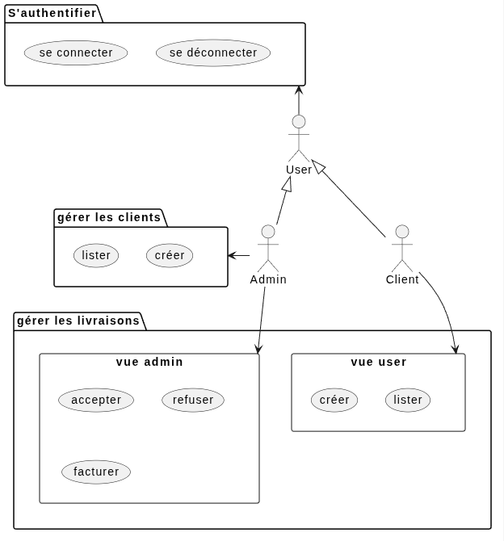
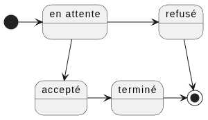
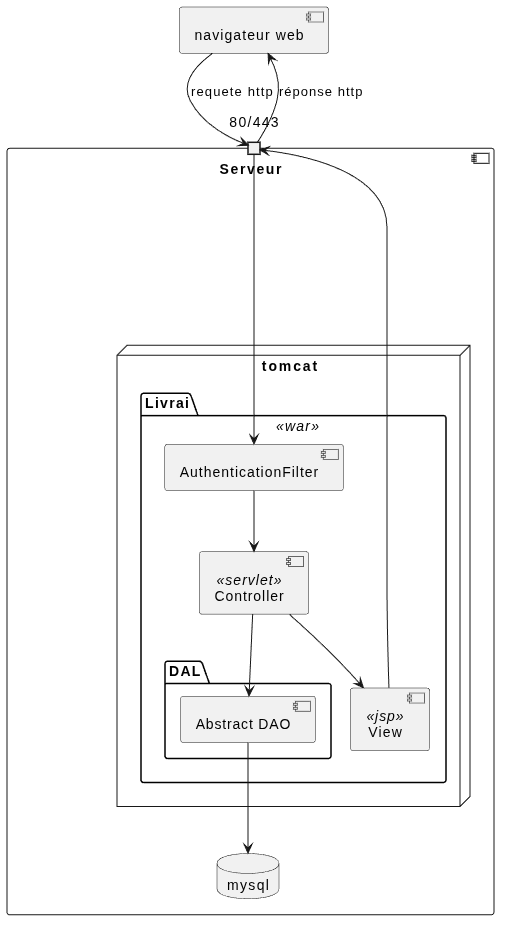

# Audit application CRM livrai
<div style="page-break-after: always;"></div>

## Contexte et périmètre

### Contexte

Livrai utilise une application basique pour la gestion de livraisons.
La croissance actuelle de l'entreprise atteint les limites de l'application.

### Périmètre

Cet audit va faire un état des lieux de l'application Livrai et servira de base pour concevoir la nouvelle architecture de l'application.

Il permettra de répondre aux questions suivantes, l'application :

1. rempli sa fonction ?
1. a des bogues ?
1. est sécurisée ?
1. est bien concue ?
1. est scalable ( supporter une grosse volumétrie ) ?
1. est résiliente ( continuité de service ) ?

<div style="page-break-after: always;"></div>

## Fonctionnalités

<!-- 
TODO Fournissez un diagramme UML fonctionnel : soit de cas d’utilisation, soit d’activité, soit de séquences 
-->
### Diagramme de cas d'utilisation

<!-- 
```plantuml
@startuml
:Admin: as a
:Client: as c
:User: as u
u <|-- a
u <|-- c

package "S'authentifier" as auth {
    usecase "se connecter" as login
    usecase "se déconnecter" as logout
} 

package "gérer les livraisons" {
    rectangle "vue admin"  as delivery_admin {
        usecase "accepter"
        usecase "refuser"
        usecase "facturer"
    }

    rectangle "vue user" as delivery_user {
        usecase "créer" as delivery_create
        usecase "lister" as delivery_list
    } 
} 
package "gérer les clients" as customer {
    usecase "lister" as customer_list
    usecase "créer"
} 


a -left-> customer
a -- > delivery_admin
c -- > delivery_user
u -up-> auth
``` 
-->



### Diagramme d'état d'une livraison
<!-- 
```plantuml
@startuml
state "en attente" as pending
state "accepté" as accepted
state "refusé" as refused
state "terminé" as invoiced

[*] -> pending
pending - -> accepted
accepted -> invoiced
invoiced -> [*]
pending -> refused
refused - -> [*]
``` -->



<div style="page-break-after: always;"></div>

## Expérience utilisateur

### Forces

- simplicité de l'interface

### Faiblesses

- bogues d'affichages sur les livraisons passées ( colonne manquante )
- pas de page d'édition des données personnelles
- pas de vérification des données saisies ( ex : poids négatif )
- le refus d'une livraison n'est pas fonctionnel
- pas de message de confirmation après une action ( création / validation de livraison )

<div style="page-break-after: always;"></div>

## Description technique

<!-- 
Fournissez un diagramme de composants UML.
Inclure les versions de langages et de frameworks utilisées
 -->

### Stack technologique

| Techno | Version | Rôle |
| --- | --- | --- | 
| Java | > 6 | Langage de programmation |
| JUnit | 4.11 | Framework de tests automatisés |
| Tomcat | 8.5 | Serveur web |
| Maven | | Outils de build | 
| MySQL | 8 | Persistence des données |

<div style="page-break-after: always;"></div>

### Diagramme de composants
<!-- 
```plantuml
@startuml
[navigateur web] as browser
component Serveur {
    port "80/443" as port_web
    database mysql 
    node tomcat {
        package Livrai <<war>> as app {
            [AuthenticationFilter] as auth_filter
            [Controller] <<servlet>> as cont
            package DAL {
                [Abstract DAO] as DAO
            }
            [View] <<jsp>> as view
        }
    }
}

DAO -- > mysql
browser -- > port_web : requete http
port_web -- > auth_filter
auth_filter -- > cont
cont -- > [DAO]
cont -- > view
view -- > port_web 
port_web -- > browser : réponse http
``` 
-->



### Points forts et déficiences

#### Points forts

- Architecture MVC en place
    - Base de code solide pour l'évolution de l'application
- Worflow d'une livraison défini
    - Le processus de livraison est clairement défini
- Utilisation de requête préparées 
    - Empêche l'injection SQL
- Utilisation de JSTL 
    - Empêche les attaques XSS

#### Déficiences

##### Sécurité

Vérification des points du top 10 OWASP 2025

| Vulnérabilité | Description | CWE | Status | Commentaire | Exemple |
| --- | --- | --- | --- | --- | --- |
| [A01:2025](https://owasp.org/Top10/2025/A01_2025-Broken_Access_Control/) | Broken Access Control | CWE-352: Cross-Site Request Forgery (CSRF) | ❌ | Pas de protection contre les attaques CSRF  | Tous les formulaires |
| [A04:2025](https://owasp.org/Top10/A04_2025-Cryptographic_Failures/) | Cryptographic Failures | CWE-261: Weak Encoding for Password | ❌ | Absence de hash des mots de passe avant stockage en BDD | `select * from user` |
| [A06:2025](https://owasp.org/Top10/2025/A06_2025-Insecure_Design/) | Insecure design | CWE-269 Improper Privilege Management | ❌ | Absence d'ACL | Un client peut créer un client en accédant à `/clients`|
| [A07:2025](https://owasp.org/Top10/2025/A07_2025-Authentication_Failures/) | Authentication Failures | CWE-521: Weak Password Requirements | ❌ | Absence de politique de mot de passe | création d'un user sans mot de passe |
| [A09:2025](https://owasp.org/Top10/2025/A09_2025-Security_Logging_and_Alerting_Failures/) | Security Logging & Alerting Failures | CWE-778: Insufficient Logging | ❌ | Absence de logs | |

##### Architecture

- erreur `java.sql.SQLNonTransientConnectionException: Too many connections` 
    - A chaque affichage d'une nouvelle page, de nouvelles connexion sont créées. 
    `show status where variable_name = 'threads_connected'`
- mot de passe d'accès à la BDD directement dans un fichier versionné
- pas de protection contre les attaques brute force
- aucun test automatisé
- application monolithique
- pas de pagination des résultats
- la structure de la BDD ne permet pas de conserver un historique des actions ( date de commande, date de validation ...)

### Analyse des risques

#### Matrice des risques

- Probabilité : 
    1. Très peu probable
    2. Peu probable
    3. Possible
    4. Très probable 
    5. Avéré
- Impacts :
    1. négligeable
    2. mineure
    3. modérée
    4. majeure
    5. catastrophique
- Risque = `Probabilité` * `Impact` : 
    - `< 10` : acceptable, pas de mitigation à prévoir
    - `< 15` : à observer et à mitiger si une solution simple existe
    - `>= 15` : à mitiger absolument

| Evénement | Probabilité | Impact | Risque |  
| --- | --- | --- | --- | 
| Crashs réguliers de l'application | 5 | 5 | 25 |
| Récupération des mots de passe en BDD | 4 | 5 | 20 | 
| Régressions fonctionnelles | 3 | 4 | 16 |
| Saisie / lecture de données incohérentes | 4 | 4 | 16 |
| Accès à des pages non prévues par les clients | 3 | 5 | 15 |

#### Définition des risques identifiés

##### Crashs réguliers de l'application

Causes : 
- Le nombre de connexion croissants à la Base de données de l'application atteindra sa limite et l'application ne sera plus disponible sans intervention
- L'absence de pagination entrainera des temps de chargement des pages de plus en plus long
- Absence de logs
- Architecture monolithique

Probabilité : 5

- Avec la croissance prévue de l'entreprise, il est certain que cet événement se produise

Impacts : 5

- Croissance
- Disponibilité
- L'application n'est plus utilisable à cause des lenteurs ou n'a plus accès à la BDD

Solutions proposées :

- Fermer les connexions à la BDD et / ou utiliser un pool de connexion
- Paginer l'affichage des listes
- Ajouter un système de logs applicatif
- Migrer vers une architecture basée sur une API

##### Récupération des mots de passe en BDD

Causes : 

- Les mots de passe sont en clair en BDD
- Les identifiants d'accès à la BDD sont versionné
- Les formulaires de login ne sont pas sécurisés contre les attaques CSRF
- Les attaques brute force sont possible
- Il n'y a aucune vérification de la complexité du mot de passe
- Absence de logs

Probabilité : 4

- Fiabilité
- N'importe quel personne ayant accès à la BDD de production a accès aux mot de passe de tous les utilisateurs
- Les hackers potentiels peuvent avoir accès aux identifiants de BDD plus facilement car ils sont versionnés

Impacts : 5

- Confidentialité
- Intégrité
- Non répudiation
- Impact sur la crédibilité de l'entreprise
- Amende dû au non respect de l'article 32 du RGPD `Sécurité du traitement`
- Utilisation frauduleuse de l'application

Solutions proposées :

- Hasher les mots de passe en BDD
- Déplacer les identifiants de connexion à la BDD dans un fichier de configuration non versionné
- Ajouter des tokens sur les formulaires générés coté serveur
- Mettre en place un délai entre les tentatives de connexion échouées
- Ajouter une vérification de la complexité du mot de passe
- Ajouter des logs applicatifs

##### Régressions fonctionnelles

Causes :

- Absence de tests automatisés

Probabilité : 3

- Le périmètre fonctionnel de l'application est réduit et réduit la probabilité d'occurence

Impacts : 4

- Fiabilité
- Impact sur la crédibilité de l'entreprise
- Impact sur la satisfaction utilisateur

Solutions proposées :

- Ajouter de tests unitaires et fonctionnels

##### Saisie / lecture de données incohérentes

Causes :

- Absences de messages d'erreurs clairs lors de mauvaises manipulation
- Absence de vérifications des données
- Des bogues d'affichages

Probabilité : 4

- Avec le temps il est certain que cela se produise 

Impacts : 3

- Fiabilité
- Impact sur la crédibilité de l'entreprise
- Intervention manuelle d'un admin pour modification
- Impact sur la satisfaction utilisateur

Solutions proposées

- Ajouter des messages de confirmation après la validation d'une action par l'utilisateur
- Nettoyer et valider les données fournies
- Corriger les bogues d'affichages

##### Accès à des pages non prévues par les clients

Causes :
- Absence d'ACL

Probabilité : 3
- Un utilisateur curieux / mal intentionné peut facilement deviner une URL existante et y accéder

Impacts : 5

- Fiabilité
- Confidentialité
- Intégrité
- Non répudiation
- Utilisation frauduleuse de l'application
- Impact sur la satisfaction utilisateur

Solution proposée :

- Protéger l'accès aux pages selon le type d'utilisateur

<div style="page-break-after: always;"></div>

## Conclusion

L'application 

- rempli sa fonction de suivi de livraison
- comporte des bogues
- n'est pas suffisament sécurisée
    - sécurise l'enregistrement et l'affichage des données
    - ne hash pas les mots de passes
    - identifiants d'accès à la BDD versionné
- a des limites dans sa conception
    - architecture MVC
    - workflow clair
- n'est pas scalable
- n'est pas résiliente

Cependant elle

- ne pourra pas supporter la croissance prévue de l'entreprise
- n'est et ne pourra pas être hautement disponible

L'application doit évoluer pour suivre la courbe de croissance de l'entreprise.
De plus des actions sont conseillées par ordre de priorité

- priorité urgente :
    - hasher les mots de passes
    - externaliser les mots de passes d'accès à la BDD
    - corriger les bogues
- priorité haute :
    - fermer les connexions à la BDD et / ou utiliser un pool de connexion
- priorité moyenne :
    - ajouter une pagination sur les pages de liste
    - ajout de tests automatisés
    - ajout de logs
- priorité basse :
    - dockeriser l'application
    - création d'une pipeline CI/CD

