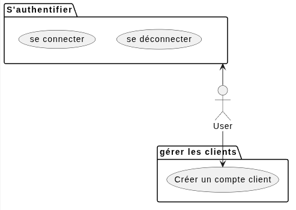
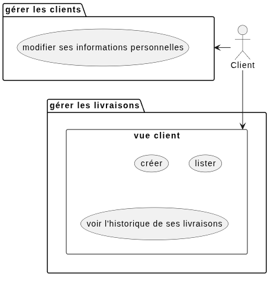
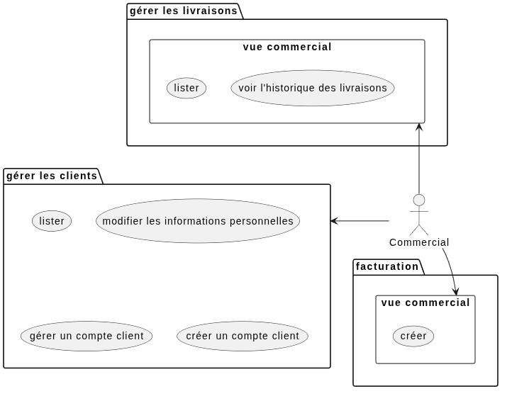
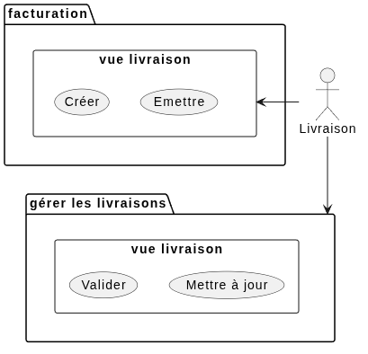
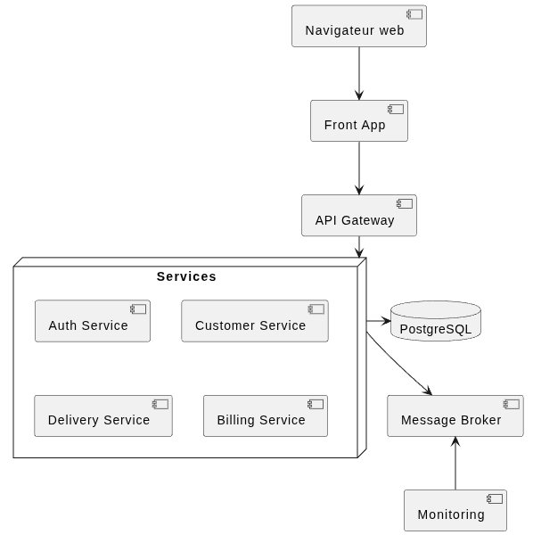

# Document d'architecture CRM livrai

<div style="page-break-after: always;"></div>

## Contexte du projet

### Besoins

Livrai utilise une application basique pour la gestion de livraisons.
La croissance actuelle de l'entreprise atteint les limites de l'application.

Lors de l'audit des limitations ont été relevées et classées par priorité.

Livrai souhaite faire évoluer l'application afin que les clients soient entièrement autonome et qu'elle soit utilisable par les services commerciaux et livraison.

### Objectifs

Pour rappel les risques suivants ont été recensés

| Evénement | Probabilité | Impact | Risque |  
| --- | --- | --- | --- | 
| Crashs réguliers de l'application | 5 | 5 | 25 |
| Récupération des mots de passe en BDD | 4 | 5 | 20 | 
| Régressions fonctionnelles | 3 | 4 | 16 |
| Saisie / lecture de données incohérentes | 4 | 4 | 16 |
| Accès à des pages non prévues par les clients | 3 | 5 | 15 |

Le refonte de l'application aura pour but d'améliorer :

- sa sécurité
- sa disponibilité
- sa résilience à la charge
- l'expérience utilisateur


- priorité urgente :
    - hasher les mots de passes
    - externaliser les mots de passes d'accès à la BDD
    - corriger les bogues
- priorité haute :
    - fermer les connexions à la BDD et / ou utiliser un pool de connexion
- priorité moyenne :
    - ajouter une pagination sur les pages de liste
    - ajout de tests automatisés
    - ajout de logs
- priorité basse :
    - dockeriser l'application
    - création d'une pipeline CI/CD


### Elements hors périmètre

<!-- 
Exclure si nécessaire certains aspects pour que le projet reste raisonnable. 

Indiquer éventuellement de possibles améliorations qui ne peuvent pas être traitées dans ce projet.
 -->

Les points suivants ne seront pas traités :

- notifications : besoin non urgent
- application mobile : une seule application web et responsive sera traitée dans ce document


<div style="page-break-after: always;"></div>

## Description fonctionnelle

3 types d'utilisateurs pourront se utiliser l'application

- Client
- Service Commercial
- Service Livraison

### Liste des fonctionnalités

### Fonctionnemnet de l'application

<!-- Inclure un diagramme UML fonctionnel (de cas d’utilisation). -->

<div style="page-break-after: always;"></div>

#### Utilisateur non connecté

<!-- 
```plantuml
@startuml
:User: as u

package "S'authentifier" as auth {
    usecase "se connecter" as login
    usecase "se déconnecter" as logout
} 

package "gérer les clients" as customer {
    usecase "Créer un compte client" as signin
} 
u -up-> auth
u -- > signin
```  -->



<div style="page-break-after: always;"></div>

#### Client
<!-- 
```plantuml
@startuml
:Client: as c

package "gérer les clients" as customer {
    usecase "modifier ses informations personnelles" as customer_personal
} 

package "gérer les livraisons" {
    rectangle "vue client" as delivery_user {
        usecase "créer" as delivery_create
        usecase "lister" as delivery_list
        usecase "voir l'historique de ses livraisons" as delivery_history
    } 
} 

c -left-> customer
c -- > delivery_user
```  -->



<div style="page-break-after: always;"></div>

#### Service commercial
<!-- 
```plantuml
@startuml
:Commercial: as c

package "gérer les clients" as customer {
    usecase "lister" as customer_list
    usecase "modifier les informations personnelles" as customer_personal
    usecase "gérer un compte client" as customer_manage
    usecase "créer un compte client" as signin
} 

package "gérer les livraisons" {
    rectangle "vue commercial" as delivery_commercial {
        usecase "lister" as delivery_list
        usecase "voir l'historique des livraisons" as delivery_history
    } 
} 

package "facturation" {
    rectangle "vue commercial" as bill_commercial {
        usecase "créer" as bill_create
    } 
} 

c -left-> customer
c -up-> delivery_commercial
c -- > bill_commercial
```  -->


<div style="page-break-after: always;"></div>

#### Service livraison
<!-- 
```plantuml
@startuml
:Livraison: as c

package "gérer les livraisons" as delivery {
    rectangle "vue livraison" as delivery_livraison {
        usecase "Valider" as delivery_validate
        usecase "Mettre à jour" as delivery_udpate
    } 
} 

package "facturation" as bill {
    rectangle "vue livraison" as bill_livraison {
        usecase "Créer" as bill_create
        usecase "Emettre" as bill_send
    } 
} 

c -- > delivery
c -left-> bill_livraison
```  -->



<div style="page-break-after: always;"></div>

## Plan de migration

Les résultats de l'audit ont permis de recenser les éléments techniques et fonctionnels qui doivent être corrigés avant que l'application puisse évoluer sereinement. Le plan ci-dessous reprend ces points et les organise par priorité afin d'assurer une refonte progressive et maîtrisée.

### Priorité 1 - Sécurisation et stabilisation du système

#### 1. Sécuriser les accès et les données sensibles

- Hasher les mots de passe des utilisateurs avec un algorithme robuste (BCrypt ou Argon2).
- Supprimer toute donnée sensible des sources de code et des fichiers versionnés.
- Externaliser les identifiants de connexion à la base de données via des variables d'environnement ou un gestionnaire de secrets.
- Mettre en place une politique de mot de passe et un contrôle d'accès par rôle.
- Ajouter des mécanismes de protection contre les attaques CSRF et le brute force.

#### 2. Corriger les vulnérabilités fonctionnelles et de sécurité

- Valider les données saisies avant insertion ou mise à jour
- Contrôler les droits d'accès aux ressources selon le profil utilisateur
- Vérifier les flux de navigation et les accès aux routes non autorisées
- Ajouter des logs pour les actions sensibles et les erreurs d'authentification

#### 3. Corriger la cause de la saturation de la base de données

- Fermer explicitement chaque connexion JDBC après usage
- Utiliser un pool de connexions pour limiter les fuites de ressources
- Contrôler la consommation de connexions sur les pages de listing
- Surveiller la durée d'exécution des requêtes pour éviter les erreurs de saturation

### Priorité 2 - Qualité fonctionnelle et expérience utilisateur

#### 1. Corriger les bogues existants

- Corriger l'affichage des livraisons passées et la présence des colonnes manquantes
- Rendre fonctionnel le refus d'une livraison
- Vérifier les statuts de livraison et leur cohérence dans le workflow

#### 2. Améliorer les interactions utilisateur

- Ajouter des messages de confirmation après une création, une validation ou un refus
- Ajouter des messages d'erreur explicites sur les validations métier
- Assurer un retour utilisateur cohérent pour chaque action

### Priorité 3 - Qualité logicielle et évolutivité

#### 1. Ajouter des tests automatisés

- Mettre en place des tests unitaires sur les méthodes métier
- Ajouter des tests d'intégration pour les contrôleurs et la couche DAO
- Créer des tests de régression sur les parcours critiques de l'application

#### 2. Gérer la volumétrie et la performance

- Implémenter la pagination des listes de livraisons et de clients
- Optimiser les requêtes SQL pour éviter les temps de chargement excessifs
- Ajouter un mécanisme de monitoring des temps de réponse et des erreurs

#### 3. Garantir la traçabilité des actions

- Stocker les dates de création, validation et clôture des livraisons
- Conserver l'historique des états et des actions effectuées par les utilisateurs

### Priorité 4 - Industrialisation et maintenance

#### 1. Préparer le déploiement

- Mise en place d'une pipeline CI/CD
- Automatisation de la compilation, des tests et du déploiement
- Documentation des procédures d'installation et de maintenance

#### 2. Préparer la montée en charge

- Conteneuriser l'application
- Orchestrer l'application pour la améliorer la scalabilité, la disponibilité et la performance

### Critères de réussite du plan de refonte

La refonte sera considérée comme réussie lorsque :

- les mots de passe ne sont plus stockés en clair
- les accès sont contrôlés selon les rôles
- les connexions à la base de données sont correctement gérées
- les bogues fonctionnels critiques sont corrigés
- les données sont validées et contrôlées
- les tests automatisés couvrent les scénarii principaux
- la solution peut évoluer sans dégradation majeure de performance

<div style="page-break-after: always;"></div>

## Description technique

<!-- 
Présenter l’ensemble des technologies utilisées.
Inclure un diagramme UML de l’architecture (des composants).
 -->

### Architecture cible recommandée

Pour répondre aux risques identifiés dans l'audit, l'architecture cible retenue est une architecture distribuée légère, avec un découpage fonctionnel par domaine métier. Cette solution permet de :

- sécuriser les accès via un point d'entrée unique
- répartir les responsabilités métier entre plusieurs services
- améliorer la disponibilité et la résilience
- préparer la montée en charge sans multiplier les couplages techniques

Les services principaux seraient :

- Service d'authentification : connexion, déconnexion, gestion des rôles et permissions
- Service client : gestion des profils, comptes et informations personnelles
- Service livraison : création, suivi, validation et refus des livraisons
- Service facturation : génération de factures et historique de facturation
- Broker de messages : évènements métier tels que création de livraison, validation, génération de facture
- Observabilité : centralisation des logs, métriques et traces

Cette cible est cohérente avec le contexte de Livrai, car elle reste suffisamment simple pour être mise en place progressivement tout en couvrant les risques de sécurité et de disponibilité relevés lors de l'audit.

### Architecture finale en microservices

L'architecture finale retenue repose sur plusieurs microservices autonomes, chacun responsable d'un domaine métier. Les services communiquent via l'API Gateway pour les requêtes synchrones et via RabbitMQ pour les événements métier asynchrones.

Le principe « une base de données par service » est retenu afin de limiter le couplage entre les domaines et de permettre à chaque service de faire évoluer son modèle de données indépendamment. Les échanges entre services s'effectuent exclusivement par API ou par événements ; aucun service ne doit accéder directement à la base de données d'un autre service.

#### Responsabilités des composants

- **Front App** : interface web responsive destinée aux clients et aux équipes internes
- **API Gateway** : point d'entrée unique, routage, contrôle des accès et limitation du trafic
- **Auth Service** : authentification, gestion des rôles, émission et validation des jetons
- **Customer Service** : comptes clients, profils et informations personnelles
- **Delivery Service** : création des livraisons, workflow des statuts et historique métier
- **Billing Service** : génération des factures et suivi de leur état
- **RabbitMQ** : diffusion des événements tels que `DeliveryCreated`, `DeliveryValidated` et `InvoiceGenerated`
- **Observability** : centralisation des logs, métriques, traces et alertes

Les opérations nécessitant une réponse immédiate, comme la consultation d'une livraison, utilisent l'API Gateway et les API REST des services concernés. Les opérations pouvant être traitées en différé, comme la génération d'une facture après validation d'une livraison, utilisent RabbitMQ. Cette séparation améliore la résilience et évite de bloquer un parcours utilisateur lorsqu'un traitement secondaire est momentanément indisponible.

#### Diagramme de l'architecture finale

```mermaid
flowchart LR

    browser["Navigateur web"] --> front["Front App"]
    front --> gateway["API Gateway"]

    subgraph microServices
        direction LR
        subgraph deliveryService
            direction LR 
            delivery --> deliverydb[("DB")]
        end

        subgraph billingService
            direction LR 
            billing --> billingdb[("DB")]
        end
        subgraph authService
            direction LR 
            auth --> authdb[("DB")]
        end
        subgraph customerService
            direction LR 
            customer --> customerdb[("DB")]
        end
    end

    gateway --> microServices
    microServices -. "événements métier" .-> broker["RabbitMQ"]
    broker -. "événements métier" .-> microServices
    broker -. "événements métier" .-> observability["Observability"]
    microServices 

    microServices -. "logs, métriques, traces" .-> observability
```

Cette architecture constitue la cible finale. La migration peut toutefois être réalisée progressivement à partir du monolithe existant, en commençant par l'authentification et le domaine livraison, qui concentrent les risques les plus importants.

<div style="page-break-after: always;"></div>

### Diagramme de composant
<!-- 
```plantuml
@startuml

component "Navigateur web" as browser
component "Front App" as front
component "API Gateway" as gateway

node "Services" as services {
    component "Auth Service" as auth
    component "Customer Service" as customer
    component "Delivery Service" as delivery
    component "Billing Service" as billing
}
component "Message Broker" as broker

database "PostgreSQL" as db
component "Monitoring" as observability

browser -- > front
front -- > gateway

gateway -- > services

services -right-> db
services -- > broker


observability -up-> broker
@enduml
``` -->


### Exemples de stack technologique

Le tableau ci-dessous propose plusieurs options technologiques, en fonction du niveau de maturité visé et du contexte de l'équipe projet.

| Composant | Option 1 - Recommandée | Option 2 |  Pourquoi |
| --- | --- | --- | --- |
| Front App | Angular | React + TypeScript |  Interface web légère, ergonomique et évolutive |
| API Gateway | Spring Cloud Gateway | NGINX + API logic | Point d'entrée unique, sécurisation et routage |
| Auth Service | Java Spring Boot | Node.js / NestJS | Gestion des comptes, sessions et permissions |
| Customer Service | Java Spring Boot | Node.js / NestJS | Gestion des profils clients et données personnelles |
| Delivery Service | Java Spring Boot | Node.js / NestJS | Workflow des livraisons, validation et statut |
| Billing Service | Java Spring Boot | Node.js / NestJS | Génération de factures et historique |
| Message Broker | RabbitMQ | Kafka | Événements métier asynchrones et découplage |
| Base de données | PostgreSQL | MariaDB | Données transactionnelles, cohérence et robustesse |
| Monitoring | ELK Stack | Prometheus + Grafana | Suivi des performances, logs et traçabilité |
| CI/CD | GitHub Actions | GitLab CI |  Intégration continue et déploiement automatisé |
| Conteneurisation | Docker Compose |Kubernetes | Portabilité et environnement reproductible |

#### Recommandation de conception

- Pour un projet comme Livrai, l'option la plus cohérente est : Java Spring Boot + PostgreSQL + RabbitMQ + Spring Cloud Gateway + Docker + ELK Stack
- Cette solution s'appuie sur une base technique déjà proche de l'application existante, tout en offrant une architecture plus robuste et scalable
- Si l'équipe préfère une stack plus légère et orientée JavaScript, une alternative pertinente est : React + NestJS + PostgreSQL + RabbitMQ + Kong + Docker
- Si l'objectif est de simplifier l'infrastructure dès le départ, une version plus légère peut être : monolithe modulaire avec Spring Boot, puis séparation progressive des services selon la croissance du volume

#### PostgreSQL vs MySQL

PostgreSQL est mieux adapté à Livrai pour plusieurs raisons fonctionnelles et techniques. 

Le projet repose sur des données transactionnelles, des relations complexes entre utilisateurs, clients, livraisons, factures et historique d'actions. 

PostgreSQL offre une meilleure robustesse pour les contraintes de cohérence, les transactions ACID, les jointures complexes et les requêtes analytiques. Il est également plus adapté à la future évolution du système, notamment si l'organisation décide d'ajouter des données historiques, des rapports métier ou des filtres avancés sur les livraisons et les factures.

De plus, PostgreSQL offre des fonctionnalités utiles dans un contexte d'audit, notamment la gestion des transactions, les index avancés, les contraintes à la base, la sécurité des accès et une meilleure évolutivité pour les cas d'usage à forte intégrité des données. Pour ce projet, cela correspond mieux aux exigences de fiabilité, de sécurité et de suivi de l'activité métier.

### Diagramme entité relation

```mermaid
erDiagram
    direction LR
    USER {
        bigint id PK
        varchar email UK
        varchar password_hash
        varchar role
        timestamp created_at
        timestamp updated_at
    }

    CUSTOMER {
        bigint id PK
        varchar first_name
        varchar last_name
        varchar company_name
        varchar phone
        text address
        timestamp created_at
        timestamp updated_at
    }

    DELIVERY {
        bigint id PK
        timestamp delivery_date
        text pickup_address
        text delivery_address
        decimal weight
        varchar status
        decimal amount
        timestamp created_at
        timestamp updated_at
    }

    INVOICE {
        bigint id PK
        varchar invoice_number UK
        decimal total_amount
        varchar status
        timestamp issued_at
        timestamp paid_at
    }

    DELIVERY_HISTORY {
        bigint id PK
        varchar previous_status
        varchar new_status
        text comment
        timestamp changed_at
    }

    USER ||--o| CUSTOMER : owns
    USER ||--o{ DELIVERY : creates
    USER ||--o{ DELIVERY_HISTORY : changes
    CUSTOMER ||--o{ DELIVERY : requests
    DELIVERY ||--o{ DELIVERY_HISTORY : tracks
    DELIVERY ||--o| INVOICE : generates
    USER ||--o{ INVOICE : issues
```

<div style="page-break-after: always;"></div>

## Procédure de livraison de l'application avec Docker

La livraison de la solution doit être reproductible, sécurisée et facilement réversible. Le principe retenu repose sur des conteneurs Docker pour l'application, la base de données et les composants complémentaires (monitoring, broker si nécessaire).

### Principes de livraison

1. Construire une image Docker fiable à partir de la version validée du code
2. Vérifier la conformité de la build via compilation et tests automatisés
3. Préparer un fichier de configuration d'environnement avec les variables de secrets
4. Déployer l'image sur l'environnement cible en mode versionné
5. Vérifier la santé de l'application avant d'ouvrir le service aux utilisateurs
6. Conserver l'image et la version déployée pour permettre un rollback rapide

### Étapes de déploiement

#### 1. Validation de la version dans la pipeline

- La branche cible est validée automatiquement par la CI/CD
- Le code est compilé, testé et scanné par la pipeline
- La pipeline génère une image Docker versionnée, par exemple : `livrai:1.2.0`
- L'image est publiée dans un registre privé ou public (Docker Hub, GitHub Container Registry, Harbor, etc.)

#### 2. Préparation de l'environnement de destination

- Vérifier la disponibilité du registre d'images
- Vérifier les variables d'environnement de production
- Vérifier la présence des secrets et des fichiers de configuration requis
- Vérifier la compatibilité de la base de données avec la nouvelle version

#### 3. Migration de la base de données

- Vérifier la présence des scripts de migration pour la nouvelle version
- Sauvegarder la base de données avant la mise à jour
- Appliquer les migrations SQL dans l'ordre défini par la version cible
- Vérifier la compatibilité du schéma avec le code de la nouvelle version
- Contrôler les données existantes afin d'éviter les régressions fonctionnelles

#### 4. Déploiement de la nouvelle image

- Pull de l'image Docker générée par la pipeline
- Arrêt du conteneur de l'ancienne version
- Démarrage du conteneur de la nouvelle version avec les variables de production
- Recréation ou mise à jour des conteneurs dépendants, tels que la base de données ou le broker si nécessaire

#### 5. Vérification post-déploiement

- Contrôler le statut des conteneurs
- Vérifier la disponibilité de l'API et de l'interface
- Vérifier l'authentification et les droits d'accès
- Vérifier l'intégrité de la base de données
- Contrôler les logs applicatifs et les métriques de performance

### Exemples de commandes Docker

```bash
docker pull registry.example.com/livrai:1.2.0
docker stop livrai-app
docker rm livrai-app
docker run -d --name livrai-app -p 8080:8080 --env-file .env registry.example.com/livrai:1.2.0
docker ps
docker logs -f livrai-app
```

### Recommandations de livraison

- Utiliser un tag versionné pour chaque livraison
- Déployer avec une stratégie de mise à jour progressive si possible
- Préserver les secrets hors du dépôt Git
- Prévoir un plan de rollback avant toute mise en production

<div style="page-break-after: always;"></div>

## Procédure de rollback basé sur Docker

La procédure de rollback doit permettre de remettre rapidement la version précédente en production en cas de défaut fonctionnel, d'erreur de configuration ou de régression de performance.

### Objectifs du rollback

- rétablir la version stable précédemment déployée
- limiter l'impact sur les utilisateurs
- préserver la cohérence de la base de données
- documenter précisément les étapes de reprise

### Principe de fonctionnement

Le rollback repose sur la conservation d'une image stable et de la configuration associée. Chaque version déployée doit être identifiable et facilement restaurable.

### Étapes de rollback

#### 1. Identifier la version précédente

- Lire le dernier tag de version fonctionnelle
- Vérifier que la version cible a bien été enregistrée localement ou dans un registre d'images

#### 2. Arrêter la version problématique

- Arrêter le conteneur de la version déployée actuellement
- Vérifier la fin des traitements en cours

#### 3. Rollback de la base de données

- Restaurer la sauvegarde de la base de données correspondant à la version précédente
- Rejouer uniquement les migrations nécessaires pour remettre le schéma dans un état compatible avec la version rollback
- Vérifier que les données conservées restent cohérentes avec le code précédent
- S'assurer qu'il n'y a pas de divergence entre la base restaurée et la version application relancée

#### 4. Relancer la version antérieure

- Démarrer le conteneur correspondant à la version précédente
- Réutiliser la configuration de cette version
- Vérifier que la base de données est compatible avec cette version

#### 5. Vérification de reprise

- Contrôler la page d'accueil
- Vérifier la connexion et la liste des livraisons
- Vérifier l'état de la base de données
- Examiner les logs afin de s'assurer que l'application est stable

### Exemple de rollback Docker

```bash
docker stop livrai-app
docker rm livrai-app
docker run -d --name livrai-app -p 8080:8080 --env-file .env livrai:1.1.0
docker ps
docker logs -f livrai-app
```

### Bonnes pratiques de rollback

- Toujours conserver la dernière image valide.
- Toujours sauvegarder les variables d'environnement avant une mise à jour.
- Éviter les migrations de base de données incompatibles avec l'ancienne version.
- Prévoir des scripts de backup de la base de données avant toute mise en production.
- En cas de migration de schéma, planifier une stratégie de compatibilité ascendante.

### Sécurité du déploiement et du rollback

- Les secrets ne doivent pas être inclus dans les images Docker.
- Les fichiers de configuration doivent être stockés hors du dépôt.
- Les services doivent être démarrés avec des droits minimaux.
- Les logs doivent être centralisés pour faciliter le diagnostic.
- Des contrôles de santé doivent être mis en place pour mesurer la disponibilité du service.

<div style="page-break-after: always;"></div>

## Observabilité et critères de qualité

L'observabilité constitue un élément clé de cette refonte. Elle permet de mesurer les performances, la stabilité et l'efficacité des composants de l'application avant, pendant et après la mise en production.

### 1. Volumétrie cible

La charge cible doit être définie à partir des besoins métier de Livrai et de la croissance attendue. À titre de référence, une architecture de cette taille peut viser :

- entre 50 et 200 transactions par minute sur les processus standards
- jusqu'à plusieurs centaines de transactions lors des pics d'activité, selon les périodes de livraison
- un temps moyen de réponse inférieur à 500 ms pour les écrans de consultation
- un temps moyen de réponse inférieur à 2 s pour les opérations métier plus lourdes, comme la création ou la validation d'une livraison.

Ces seuils doivent être validés à l'aide de tests de charge et adaptés en fonction du nombre réel de clients et du volume de livraisons processed quotidiennement.

Les indicateurs à suivre sont :

- nombre de requêtes HTTP par minute
- temps de réponse moyen et p95
- nombre d'erreurs HTTP
- nombre de transactions BDD par seconde
- taux d'utilisation mémoire et CPU des conteneurs

### 2. Disponibilité

Une cible réaliste pour cette architecture est une disponibilité de 99,5 % à 99,9 %, selon le niveau de criticité du service. Cela correspond à un temps de non-disponibilité acceptable de quelques heures par mois, à condition qu'un plan de reprise rapide soit en place.

Compte tenu du contexte métier, un arrêt du service peut être toléré pendant les fenêtres de maintenance ou pendant les moments de faible activité. En revanche, le service ne doit pas être indisponible pendant les périodes de fortes opérations de livraison. Le temps de redémarrage et le rollback doivent donc être le plus rapides possible.

Les indicateurs associés sont :

- disponibilité globale du service
- temps moyen de récupération après incident
- nombre d'incidents de production
- taux d'erreurs sur les endpoints critiques

### 3. Maintenabilité

La maintenabilité dépend directement de la clarté du code, de la structure applicative et de la qualité des procédures de déploiement. Elle est renforcée par :

- séparation claire des responsabilités entre couche web, services métier et accès aux données
- logs structurés et centralisés
- configuration externalisée
- tests automatiques et pipeline CI/CD
- versions dockerisées et reproductibles
- procédures de déploiement et de rollback documentées

Une application facilement maintenable permet de réduire le temps de correction des anomalies, de limiter la dette technique et de faciliter la montée en charge sans réécriture complète du système.

<div style="page-break-after: always;"></div>

## Correction des problèmes identifiés dans l'audit

Les actions de refonte décrites dans ce document ne sont pas seulement techniques : elles répondent directement aux risques recensés dans l'audit.

### Sécurité

- Le hashage des mots de passe permet de corriger le risque de récupération des mots de passe en base de données
- L'externalisation des secrets de connexion évite la diffusion accidentelle des identifiants de la base de données
- Les contrôles d'accès et les rôles limitent les accès non prévus, notamment pour les parcours clients et commerciaux
- La protection contre les attaques CSRF et le bruteforce réduit les risques d'usurpation et d'accès non autorisé
- Les logs de sécurité et la centralisation des traces permettent de diagnostiquer les incidents et de sécuriser les opérations sensibles

### Stabilité et disponibilité

- La fermeture correcte des connexions JDBC et l'utilisation d'un pool de connexion limitent la saturation de la base de données et évitent l'erreur `Too many connections`
- Les conteneurs Docker et la procédure de déploiement standardisée rendent la mise en production plus fiable et plus répétable
- La politique de rollback permet de reprendre rapidement une version stable en cas de régression
- Le monitoring et les indicateurs de performance permettent de détecter les dérives avant qu'elles ne deviennent critiques

### Qualité fonctionnelle

- La validation des données évite les erreurs de saisie, comme les poids négatifs ou les informations incohérentes
- Les messages de confirmation et les retours utilisateur réduisent les erreurs de manipulation
- Le workflow des livraisons devient explicite et contrôlé, ce qui corrige le refus de livraison ou les états incohérents
- Les tests automatisés permettent d'éviter les régressions fonctionnelles sur les parcours critiques

### Performance et évolutivité

- La pagination des listes réduit les temps de chargement et améliore la navigation sur les grandes quantités de données
- L'architecture modulaire permet d'isoler les services métier et de mieux supporter la croissance du volume
- L'utilisation de composants déployés dans des conteneurs facilite la mise à l'échelle et l'ajout de nouvelles capacités sans réécrire l'ensemble de l'application

### Maintenabilité et traçabilité

- Les logs et l'historique des livraisons permettent de suivre les actions et d'intervenir rapidement en cas d'incohérence
- La séparation des responsabilités, la documentation technique et la procédure de déploiement renforcent la maintenabilité
- Les outils de CI/CD et de déploiement automatisé réduisent les risques humains et stabilisent les livraisons

En synthèse, la refonte n'est pas seulement une évolution de l'architecture : elle répond directement aux risques et aux défauts relevés dans l'audit et les transforme en leviers de sécurité, de performance, de fiabilité et de maintenance.

<div style="page-break-after: always;"></div>

## Conclusion

L'architecture cible proposée permet d'améliorer significativement la sécurité, la disponibilité et l'évolutivité de l'application. L'accent mis sur une livraison Dockerisée et une politique de rollback explicite constitue une réponse adaptée aux risques identifiés lors de l'audit, en limitant les interruptions de service et en renforçant la fiabilité du système.

